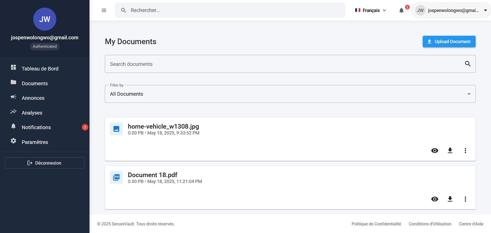

# SecureVault Military (SVM)

[](https://app.netlify.com/sites/secure-vault-military/deploys)

**Live Demo:** [https://secure-vault-military.netlify.app/dashboard](https://secure-vault-military.netlify.app/dashboard)

SecureVault Military (SVM) is a secure document storage and communication platform designed specifically for military personnel, featuring end-to-end encryption, role-based access control, and secure messaging.


## Features

- 🔐 Secure document storage with client-side encryption
- 🆔 Military ID-based authentication with hierarchical validation
- 📢 Secure communication channels with read receipts
- 🛡️ Role-based access control
- 📊 Audit logging and compliance

## Tech Stack

- **Frontend**: Angular 17+
- **Backend**: Supabase (PostgreSQL, Auth, Storage)
- **Styling**: Angular Material + SCSS
- **Testing**: Jest, Cypress
- **CI/CD**: GitHub Actions

## Getting Started

### Prerequisites

- Node.js 18+
- npm 9+ or yarn
- Supabase CLI (for local development)

### Installation

1. Clone the repository:

   ```bash
   git clone https://github.com/JospenWolongwo/secure-vault-military.git
   cd secure-vault-military
   ```

2. Install dependencies:

   ```bash
   npm install
   ```

3. Set up environment variables:

   ```bash
   cp .env.example .env
   # Update the environment variables in .env
   ```

4. Start the development server:
   ```bash
   ng serve
   ```

## Development

### Code Style

- Follow [Angular Style Guide](https://angular.io/guide/styleguide)
- Use TypeScript strict mode
- Write meaningful commit messages

### Branching Strategy

- `main` - Production code (protected)
- `develop` - Development branch
- `feature/*` - New features
- `fix/*` - Bug fixes
- `chore/*` - Maintenance tasks

## Testing

```bash
# Unit tests
npm test

# E2E tests
npm run e2e
```

## Deployment

Deployment is handled automatically via GitHub Actions. Push to `main` for production or `develop` for staging.

## Security

Please report any security issues to jospenwolongwo@gmail.com

## License

This project is licensed under the MIT License - see the [LICENSE](LICENSE) file for details.

## Screenshots

### Dashboard


### Document Management



### Announcements


### Mobile Experience


## Contact

- **Developer**: Jospen Wolongwo
- **Email**: [jospenwolongwo@gmail.com](mailto:jospenwolongwo@gmail.com)
- **Website**: [jospenwolongwo.com](https://jospenwolongwo.com)
- **GitHub**: [JospenWolongwo](https://github.com/JospenWolongwo)
